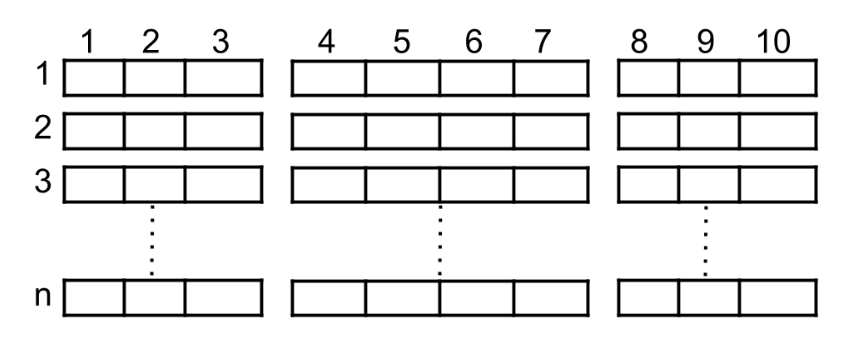

# Easy

## Two Sum

Easy - Companies

Given an array of integers nums and an integer target, return *indices of the two numbers such that they add up to target.*
You may assume that each input would have **_exactly_** one solution, and you may not use the *same* element twice.
You can return the answer in any order.

Example 1:

    Input: nums = [2,7,11,15], target = 9
    Output: [0,1]
    Explanation: Because nums[0] + nums[1] == 9, we return [0, 1].

Example 2:

    Input: nums = [3,2,4], target = 6
    Output: [1,2]

Example 3:

    Input: nums = [3,3], target = 6
    Output: [0,1]

Constraints:

- 2 <= nums.length <= 104
- -109 <= nums[i] <= 109
- -109 <= target <= 109
- Only one valid answer exists.

Follow-up: Can you come up with an algorithm that is less than O(n2) time complexity?

## Verifying an Alien Dictionary

In an alien language, surprisingly, they also use English lowercase letters, but possibly in a different order. The order of the alphabet is some permutation of lowercase letters.
Given a sequence of words written in the alien language, and the order of the alphabet, return true if and only if the given words are sorted lexicographically in this alien language.

Example 1:

    Input: words = ["hello","leetcode"], order = "hlabcdefgijkmnopqrstuvwxyz"
    Output: true
    Explanation: As 'h' comes before 'l' in this language, then the sequence is sorted.

Example 2:

    Input: words = ["word","world","row"], order = "worldabcefghijkmnpqstuvxyz"
    Output: false
    Explanation: As 'd' comes after 'l' in this language, then words[0] > words[1], hence the sequence is unsorted.

Example 3:

    Input: words = ["apple","app"], order = "abcdefghijklmnopqrstuvwxyz"
    Output: false
    Explanation: The first three characters "app" match, and the second string is shorter (in size.) According to lexicographical rules "apple" > "app", because 'l' > '∅', where '∅' is defined as the blank character which is less than any other character (More info).

Constraints:

- 1 <= words.length <= 100
- 1 <= words[i].length <= 20
- order.length == 26
- All characters in words[i] and order are English lowercase letters.

# Medium

## Cinema Seat Allocation

Medium - Companies

A cinema has n rows of seats, numbered from 1 to n and there are ten seats in each row, labelled from 1 to 10 as shown in the figure above.

Given the array reservedSeats containing the numbers of seats already reserved, for example, reservedSeats[i] = [3,8] means the seat located in row 3 and labelled with 8 is already reserved.

Return the maximum number of four-person groups you can assign on the cinema seats. A four-person group occupies four adjacent seats in one single row. Seats across an aisle (such as [3,3] and [3,4]) are not considered to be adjacent, but there is an exceptional case on which an aisle split a four-person group, in that case, the aisle split a four-person group in the middle, which means to have two people on each side.

Example 1:

Input: n = 3, reservedSeats = [[1,2],[1,3],[1,8],[2,6],[3,1],[3,10]]
Output: 4
Explanation: The figure above shows the optimal allocation for four groups, where seats mark with blue are already reserved and contiguous seats mark with orange are for one group.
Example 2:

Input: n = 2, reservedSeats = [[2,1],[1,8],[2,6]]
Output: 2
Example 3:

Input: n = 4, reservedSeats = [[4,3],[1,4],[4,6],[1,7]]
Output: 4

Constraints:

1 <= n <= 10^9
1 <= reservedSeats.length <= min(10*n, 10^4)
reservedSeats[i].length == 2
1 <= reservedSeats[i][0] <= n
1 <= reservedSeats[i][1] <= 10
All reservedSeats[i] are distinct.
