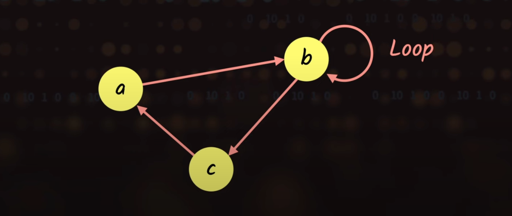
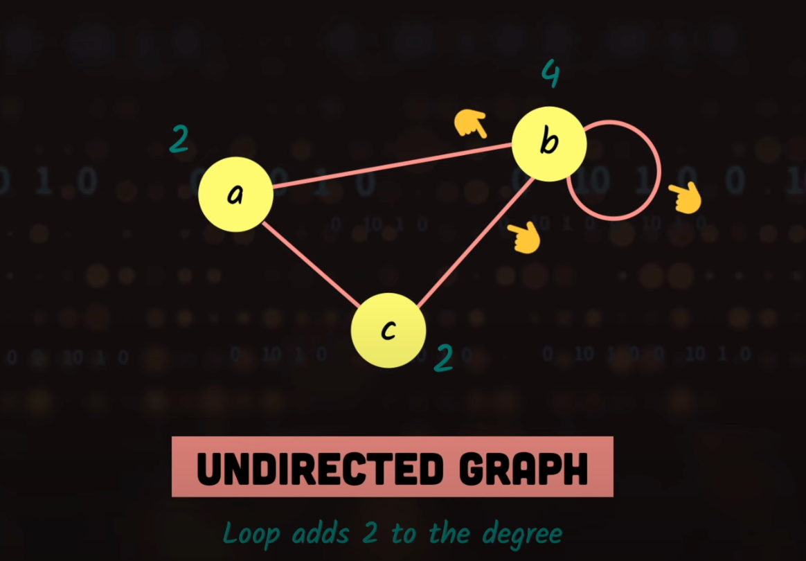
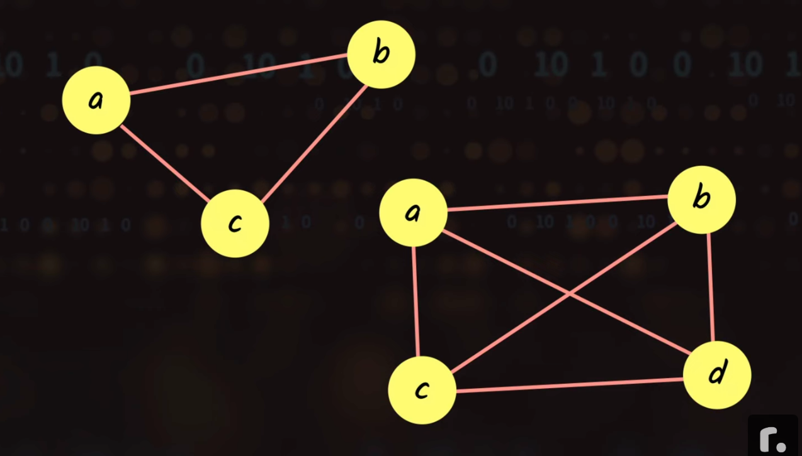
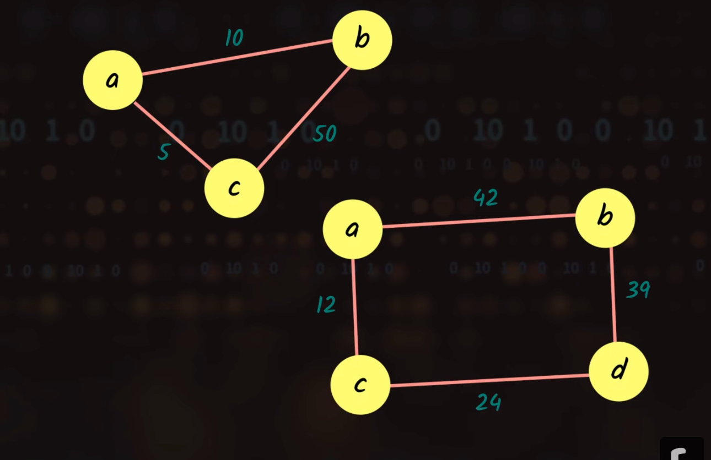
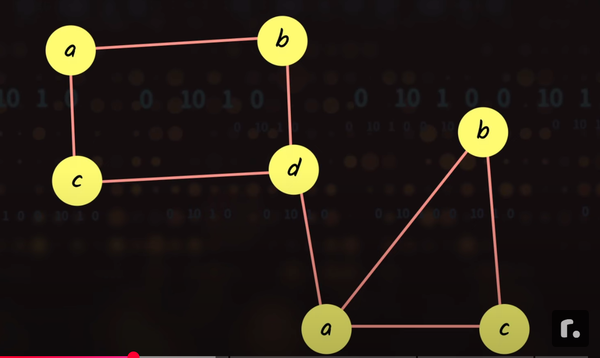
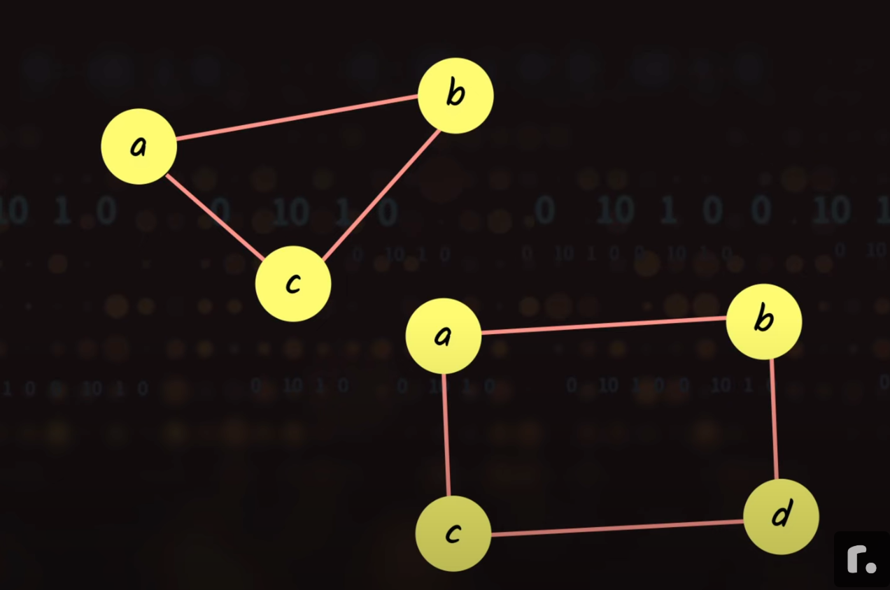
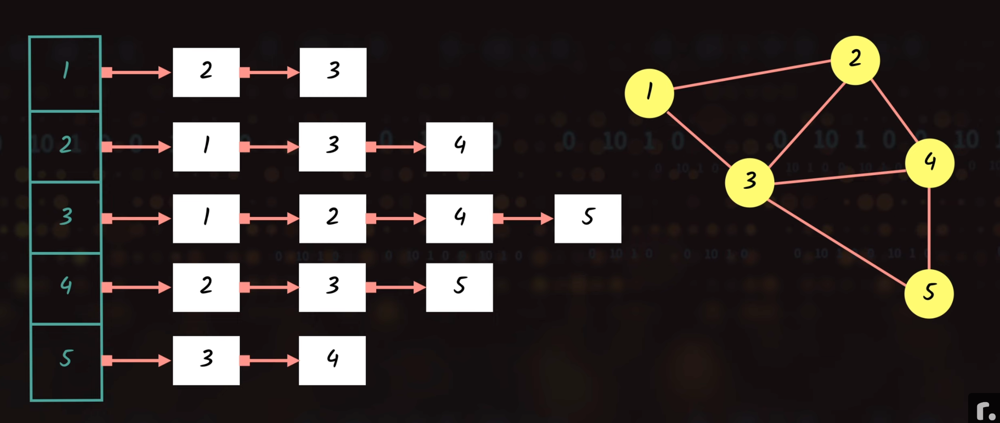
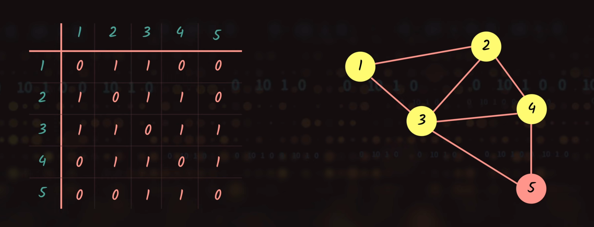

# Graph
- A non-linear data structure consisting of vertices (nodes) and edges that connect these vertices

## Terminology
- Vertex: A node in the graph
- Edge: A connection between two vertices
  - Loop: An edge that connects a vertex to itself

    

  - Degree of a vertex
    1. Undirected graph: The number of edges connected to a vertex

    

    2. Directed graph:
      - In-degree: The number of edges coming into a vertex
      - Out-degree: The number of edges coming out of a vertex

    

- Path: A sequence of vertices and edges connecting two vertices
  - Simple path: A path that does not visit any vertex more than once
  - Closed path: A path that starts and ends at the same vertex

## Types of graphs:

### Simple graph:
- A graph with no loops or multiple edges between the same pair of vertices

### Complete graph:
- A graph where every vertex is connected to every other vertex

    

### Directed vs Undirected graphs:
- Directed graphs have edges with a direction
- Undirected graphs have edges without direction

### Weighted vs Unweighted graphs:
- Weighted graphs have edges with a numerical value representing the cost or weight of the edge

    

- Unweighted graphs have edges with no numerical value

### Connected vs Disconnected graphs:
- Connected graphs have a path between every pair of vertices

    

- Disconnected graphs have at least one pair of vertices that are not connected by a path

    

### Cyclic vs Acyclic graphs:
- Cyclic graphs have at least one cycle

    

- Acyclic graphs have no cycles

    

## Common operations:
  - Add vertex/edge
  - Remove vertex/edge
  - Find path between vertices
  - Check if vertices are connected
  - Traverse the graph (DFS, BFS)

## Common representations:
  - Adjacency Matrix
  - Adjacency List
  - Edge List

## Common use cases:
  - Social networks
    - Undirected: Friendship (if A is friends with B, B is friends with A)
    - Directed: Following (A can follow B without B following A)
  - Road networks/Maps
    - Undirected: Two-way streets
    - Directed: One-way streets
    - Weighted: Distance or travel time between locations
  - Computer networks
    - Directed: Data flow direction
    - Weighted: Bandwidth or capacity
  - Recommendation systems
  - State machines

## Graph Representation

### Adjacency List
- An adjacency list is a collection of lists that represent the connections between vertices in a graph.
- Each vertex has a list of adjacent vertices.

    

### Adjacency Matrix
- An adjacency matrix is a 2D array that represents the connections between vertices in a graph.
- The matrix is square (n x n) where n is the number of vertices.

    

## Graph Algorithms

### Graph Traversal
- Depth-First Search (DFS): Explore as far as possible along each branch before backtracking.
- Breadth-First Search (BFS): Explore all nodes at the current depth prior to moving on to nodes at the next depth level.

### Shortest Path
- Find the shortest path between two vertices

### Minimum Spanning Tree
- Find the minimum weight edge that connects all vertices

### Topological Sort
- Order vertices in a way that respects dependencies

### Strongly Connected Components
- Find all vertices that are part of a cycle

## References:
  - [Graph Data Structure | Illustrated Data Structures](https://www.youtube.com/watch?v=0sQE8zKhad0)
