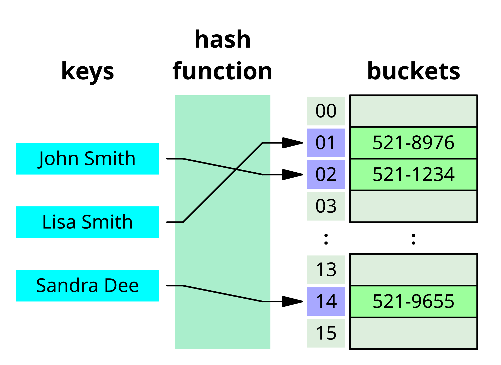
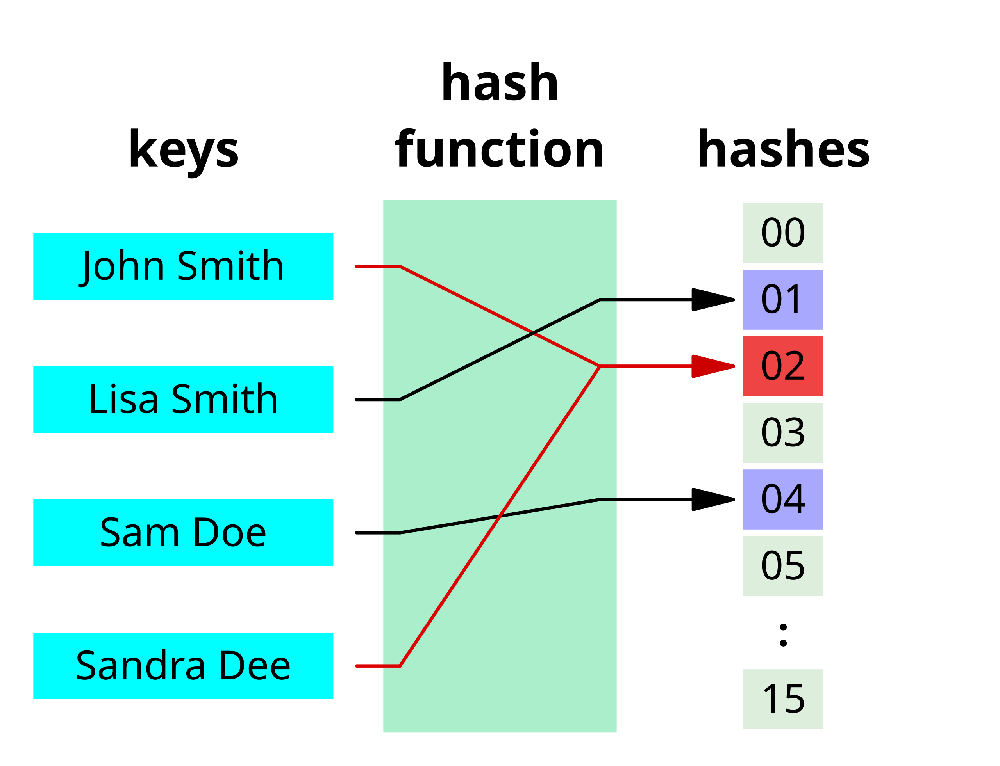
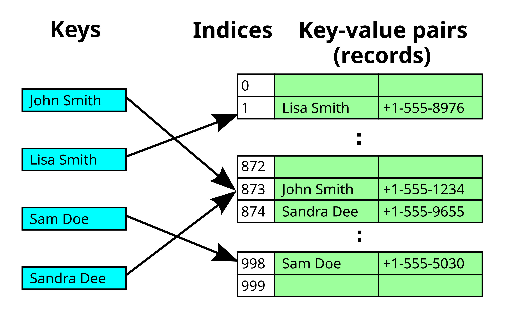
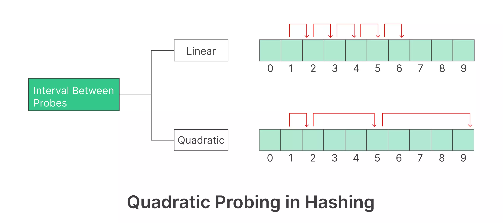
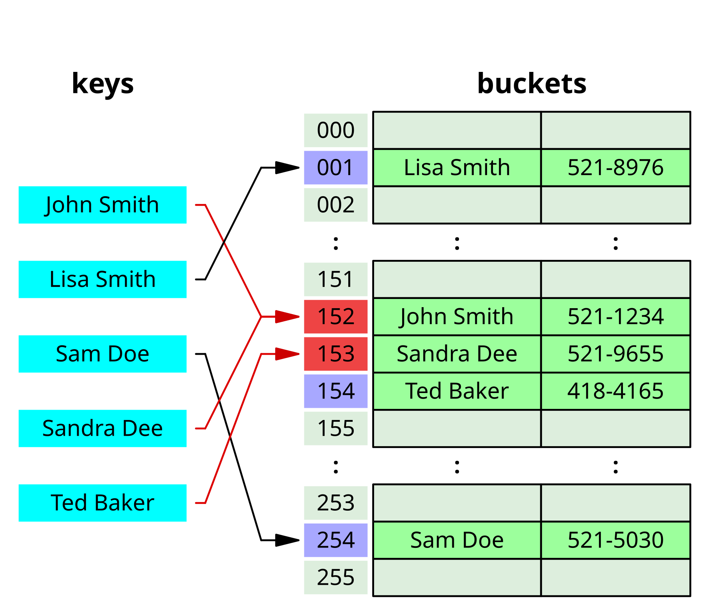
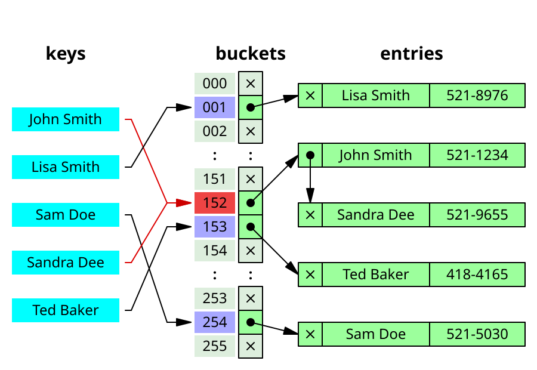
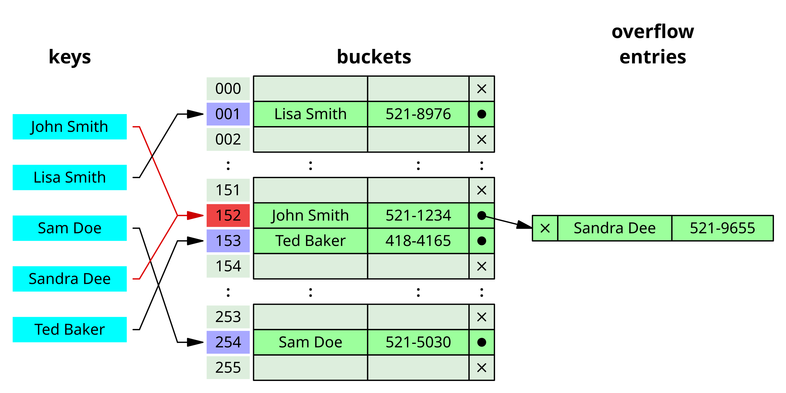

# Hash Table (aka Hash Map)
- Also known as: hash map, hash set, hash table.
- Is an associative array (a key-value pair), e.g. map, dictionary.
- It uses a has function to compute the *index*, also called *hash code*, to an array of *buckets* or *slots* where the value is stored.



## Hash function
- To convert key to a **hash value**, which serves as an index to the array of buckets.

### Hash Value
- Is a *fixed-size numerical value* (e.g. hexadecimal: 10 digits 0-9 and 6 characters A-F) that represents as a *unique identifier* for the key.
- Is a *one-way function* that is easy to compute but hard to reverse.

### Common Hash Algorithms
- MD5: 128-bit hash value, obsolete due to vulnerabilities.
- SHA-1: 160-bit hash value, obsolete due to vulnerabilities.
- **SHA-256: 256-bit hash value, widely used.**
- SHA-384: 384-bit hash value, less common.
- SHA-512: 512-bit hash value, less common.

  ```ruby
  require "digest"
  Digest::SHA256.hexdigest("hello") # => "2cf24dba5fb0a30e26e83b2ac5b9e29e1b161e5c1fa7425e73043362938b9824"
  ```

## Buckets
- Are containers that hold the key-value pairs.

## Load Factor
- Represents the ratio of stored elements to the number of buckets:
  ```
  load_factor = number_of_elements / number_of_buckets
  ```

- Is a key performance metric for hash tables, serving as a threshold for resizing the table.
- A high load factor indicates that the hash table is becoming full, which can lead to performance degradation.

## Threshold and Rehashing
- Threshold is the load factor at which the hash table is resized.
- A common threshold is **0.75**, meaning that the hash table is resized when 75% of the buckets are occupied.
- Array Resizing is a common method to scale the hash table:
  1. Doubling Size (aka rehashing):
    - The new size is typically double the current size.
    - The keys are rehashed and redistributed into the new array.
  2. Halving Size:
    - The new size is typically half the current size.
    - The keys are rehashed and redistributed into the new array.

## Hash collisions
- Where the hash function generates **the same index** for more than one key.



### Hash collision resolution

Common strategies:
1. Open addressing (aka closed hashing):

  


  - A cell in the hash table is assigned state: empty, occupied, deleted.
  - When a collision occurs, the hash table will be probed for the next empty cell.
  - Probing strategies:
    - Linear probing: check next bucket sequentially (index + 1, index + 2, etc.)
    - Quadratic probing: check buckets at quadratic intervals (index + 1², index + 2², etc.)

    

      *In the following example: hash collision resolved by open addressing with linear probing (interval=1). Note that "Ted Baker" has a unique hash, but nevertheless collided with "Sandra Dee", that had previously collided with "John Smith".*

    

    - Double hashing: use second hash function to determine probe sequence
2. Separate chaining (aka open hashing):
  - More than one records are "chained" to a cell in the hash table. If two records are hashed to the same index, both would go to the same cell as a linked list.

    *Hash collision resolved by linked list*
    

    *Hash collision by separate chaining with head records in the bucket array.*
    

## Common operations:
  - Insert: Add a key-value pair to the hash table
  - Delete: Remove a key-value pair from the hash table
  - Search: Find the value associated with a key

## Common use cases:
  - Caching
  - Dictionary lookup
  - Database indexing
  - Symbol tables in compilers
  - Router tables in networking

## Operations:
- To insert a key-value pair: use an array of linked lists and a hash code function
    1. compute the key's hash code, e.g. "aa" -> 123
    2. map the hash code to an index in the array: use modulo operator, e.g. 123 % 64 = 23, where 64 is the size of the array
    3. store the key-value pair at the index. At this index, we have a linked list of key-value pairs.

    To retrieve the value, repeat this process: compute the hash code of the key, map it to an index, and retrieve the linked list at that index. The lookup is O(1) because we only need to traverse the linked list at the index. However, if the number of collisions is high, the lookup can be O(n).

    Example:
    ```
    Array size: 8
    Strings to hash: ["cat", "dog", "rat", "art"]

    Simplified hash function: sum of ASCII values % array_size

    "cat" -> (99 + 97 + 116) % 8 = 312 % 8 = 0
    "dog" -> (100 + 111 + 103) % 8 = 314 % 8 = 2
    "rat" -> (114 + 97 + 116) % 8 = 327 % 8 = 7
    "art" -> (97 + 114 + 116) % 8 = 327 % 8 = 7  // Notice collision with "rat"

    Final array structure:
    [0] -> ["cat"]
    [1] -> []
    [2] -> ["dog"]
    [3] -> []
    [4] -> []
    [5] -> []
    [6] -> []
    [7] -> ["rat"] -> ["art"]  // Collision handled by linked list
    ```
## References
- [Hash Table](https://en.wikipedia.org/wiki/Hash_table)
- [Hash Table Interview Questions](https://github.com/Devinterview-io/hash-table-data-structure-interview-questions)
