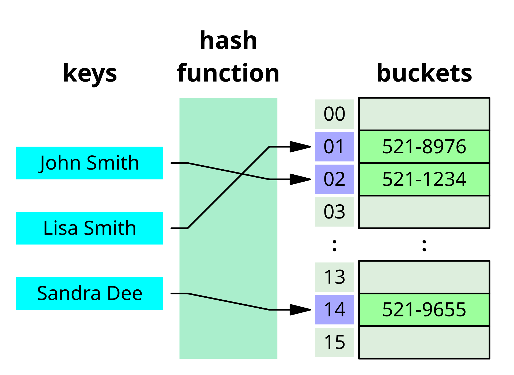
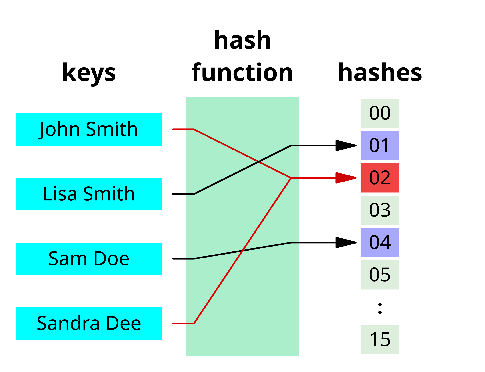
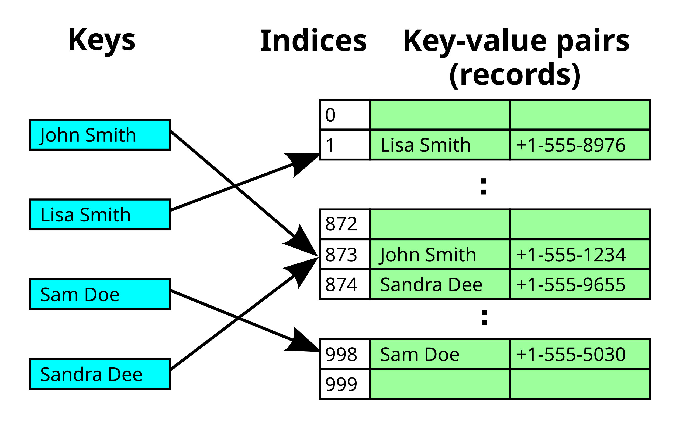

# Hash Table (aka Hash Map)
- Also known as: hash map, hash set, hash table.
- To implement an associative array (a key-value pair), e.g. map, dictionary.
- It uses a has function to compute the *index*, also called *hash code*, to an array of *buckets* or *slots* where the value is stored.


## Hash collisions
- Where the hash function generates **the same index** for more than one key.



### Hash collision resolution
- To resolve hash collisions, we can use a linked list to store the key-value pairs at the same index.



#### Common strategies:
1. Open addressing (aka closed hashing):
  - A cell in the hash table is assigned state: empty, occupied, deleted.
  - When a collision occurs, the hash table will be probed for the next empty cell.
  - Probing strategies:
    - Linear probing: check next bucket sequentially (index + 1, index + 2, etc.)
    - Double hashing: use second hash function to determine probe sequence
    - Quadratic probing: check buckets at quadratic intervals (index + 1², index + 2², etc.)
2. Separate chaining (aka open hashing):
  - More than one records are "chained" to a cell in the hash table. If two records are hashed to the same index, both would go to the same cell as a linked list.

## Common operations:
  - Insert: Add a key-value pair to the hash table
  - Delete: Remove a key-value pair from the hash table
  - Search: Find the value associated with a key

## Common use cases:
  - Caching
  - Database indexing
  - Symbol tables in compilers
  - Router tables in networking

### Exercises:
- To insert a key-value pair: use an array of linked lists and a hash code function
    1. compute the key's hash code, e.g. "aa" -> 123
    2. map the hash code to an index in the array: use modulo operator, e.g. 123 % 64 = 23, where 64 is the size of the array
    3. store the key-value pair at the index. At this index, we have a linked list of key-value pairs.

    To retrieve the value, repeat this process: compute the hash code of the key, map it to an index, and retrieve the linked list at that index. The lookup is O(1) because we only need to traverse the linked list at the index. However, if the number of collisions is high, the lookup can be O(n).

    Example:
    ```
    Array size: 8
    Strings to hash: ["cat", "dog", "rat", "art"]

    Simplified hash function: sum of ASCII values % array_size

    "cat" -> (99 + 97 + 116) % 8 = 312 % 8 = 0
    "dog" -> (100 + 111 + 103) % 8 = 314 % 8 = 2
    "rat" -> (114 + 97 + 116) % 8 = 327 % 8 = 7
    "art" -> (97 + 114 + 116) % 8 = 327 % 8 = 7  // Notice collision with "rat"

    Final array structure:
    [0] -> ["cat"]
    [1] -> []
    [2] -> ["dog"]
    [3] -> []
    [4] -> []
    [5] -> []
    [6] -> []
    [7] -> ["rat"] -> ["art"]  // Collision handled by linked list
    ```

References:
- [Hash Table](https://en.wikipedia.org/wiki/Hash_table)
