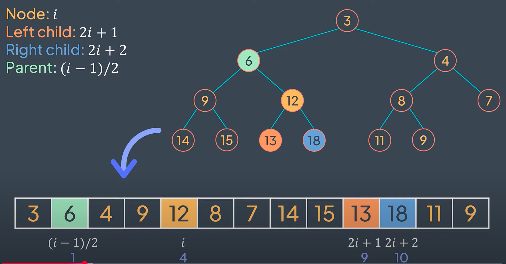
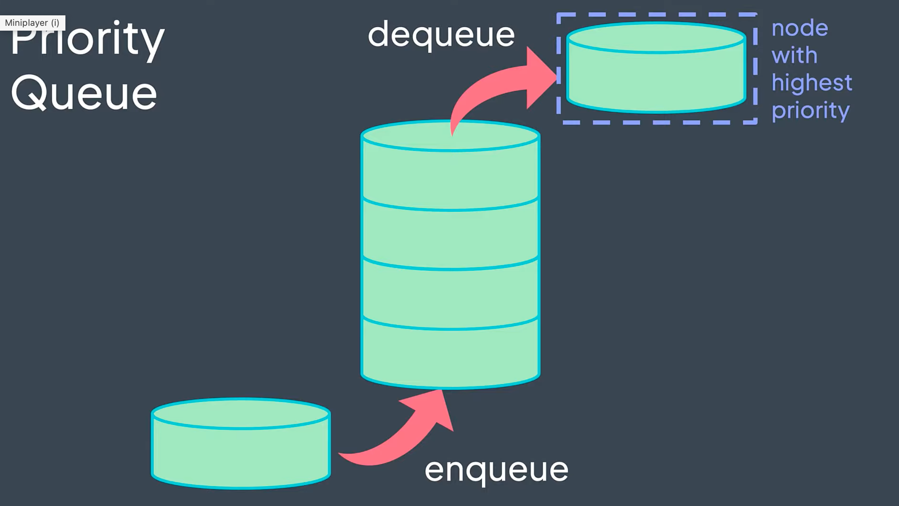

# Heap

A *complete binary tree* that satisfies the heap property (max-heap or min-heap).

Node relationships:
- Node at index i
- Parent of node at index i: (i-1)/2
- Left child of node at index i: 2i + 1
- Right child of node at index i: 2i + 2



## Max-Heap

The value of parent nodes are always greater than or equal to their children's values.

Properties:

```
value(parent) >= value(child)
value(child) <= value(parent)
```

Example:

```
array = [100, 19, 36, 17, 3, 25, 1, 2, 7]

       100        // Every parent is greater than its children
      /   \
    19     36
   /  \   /  \
  17   3 25   1
 /  \
2    7
```

## Min-Heap:

The value of parent nodes are always less than or equal to their children's values.

Properties:

```
value(parent) <= value(child)
value(child) >= value(parent)
```

Example:

```
array = [3, 6, 4, 9, 12, 8, 7, 14, 15, 13, 18, 11, 9]

            3           // Every parent is smaller than its children
        /        \
      6            4
    /  \          /  \
  9     12       8    7
 /  \   / \     / \
14  15 13 18  11   9
```

## Common operations
  - Insert: Add a new element to the heap
  - Delete: Remove the root element from the heap
  - Peek: Return the root element of the heap without removing it
  - IsEmpty: Check if the heap is empty

## Heap Sort
1. Build a heap from the array (max-heap or min-heap)
2. Extract the root element from the heap and add it to the sorted array
3. Repeat step 2 until the heap is empty

## Priority Queue

A priority queue is a data structure that allows you to insert elements with a priority and extract the element with the highest priority.



Operations:
- Enqueue: Add an element to the priority queue
- Dequeue: Remove the element with the highest priority from the priority queue
- Peek: Return the element with the highest priority without removing it
- Change Priority: Change the priority of an element
- IsEmpty: Check if the priority queue is empty

## Common use cases:
  - Priority Queues
  - Heap Sort
  - Finding kth smallest/largest elements
  - Median maintenance

Examples:

1. Max-Heap Example:


2. Min-Heap Example:
```
        1               Every parent is smaller than its children
      /   \
    4      2
   /  \   /  \
  7    5 3    6
 /  \
9    8

Properties:
- Root (1) is the minimum element
- Same parent/child index relationships
```

Operation Examples:

1. Insert(15) into min-heap:
```
Initial:                After Insert:           After Bubble-Down:
       3                     3                        3
     /   \                /   \                    /   \
    4     8              4     8                  4     8
   / \                  / \   /                  / \   /
  11  5               11  5  15                11  5  15

Step-by-step:
1. Initial state: [3, 4, 8, 11, 5]
2. Insert 15 at next available position (as leftmost child of 8)
3. No bubble-up needed since 15 > 8 (parent)
4. Final state: [3, 4, 8, 11, 5, 15]

Array representation:
Index:    0  1  2  3  4  5
Initial: [3, 4, 8, 11, 5]
Final:   [3, 4, 8, 11, 5, 15]
```

2. Insert(15) into max-heap:
```
Initial:                After Insert:           After Bubble-Up:
      11                    11                       15     // Bubble-up 15 > 8 then 15 > 11 (root)
     /  \                 /  \                     /  \
    5    8              5    8                    5    11
   / \                 / \  /                   / \   /
  3   4              3   4 15                  3   4 8

Step-by-step:
1. Initial state: [11, 5, 8, 3, 4]
2. Insert 15 at next available position (as leftmost child of 8)
3. Bubble-up needed since 15 > 8 (parent) and 15 > 11 (root)
4. Final state: [15, 11, 8, 3, 4, 5]

Array representation:
Index:    0   1  2  3  4  5
Initial: [11, 5, 8, 3, 4]
Final:   [15, 5, 11, 3, 4, 8]
```

3. Extract Root (Delete Max) from max-heap:
```
Initial:                 Move Last to Root:      After Bubble-Down:
       15                      5                      11
     /    \                  /   \                  /   \
   11      8               11    8                 5     8
  /  \    /               /  \                    / \
 3    4  5               3    4                  3   4

Step-by-step:
1. Initial state: [15, 11, 8, 3, 4, 5]
2. Save root value (15) to return later
3. Move last element (5) to root position
4. Bubble-down needed since 5 < 11 (left child) and 5 < 8 (right child)
   - Swap with larger child (11)
5. Final state: [11, 5, 8, 3, 4]

Array representation:
Index:    0   1  2  3  4  5
Initial: [15, 11, 8, 3, 4, 5]
Final:   [11, 5, 8, 3, 4]

Return value: 15
```

Array Representation (Max-Heap):
```
Index:  0   1   2   3   4   5   6   7   8
Array: [100, 19, 36, 17, 3, 25, 1, 2, 7]

                100
               /   \
             19     36
            /  \   /  \
           17   3 25   1
          /  \
         2    7
```

Common Applications:
- Priority Queues
- Heap Sort
- Finding kth smallest/largest elements
- Median maintenance

References:
- [Heap](https://www.youtube.com/watch?v=F_r0sJ1RqWk)
- [Heap Sort](https://www.youtube.com/watch?v=2DmK_H7IdTo)
- [Building a Max-Heap from an Array](https://www.youtube.com/watch?v=pAU21g-jBiE)
